# Kafka notes

These are the most relevant contents that I collected through some books and courses. I organized and make some edits to help deliver the concepts about Apache Kafka in the most comprehensible way. Anyone who wants to learn Apache Kafka can reference these notes without going through too many resources on the Internet. Below might be the only material you need to grasp quite a basic understanding of Kafka as well as how to configure your applications to use Kafka properly in production.

If you want to get a deeper understanding of Kafka or how to use Kafka Stream for big data processing. I highly recommend you check out the material including some books and courses that I linked in the reference section.

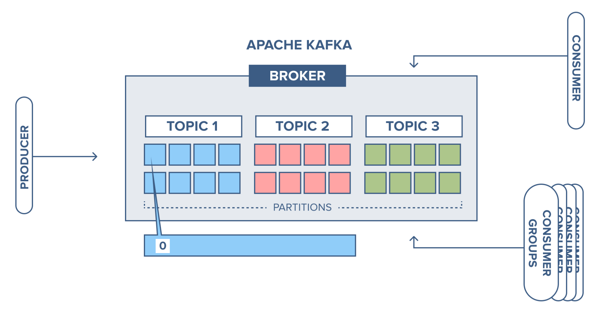
<sup>image from https://www.cloudkarafka.com/blog/<sup>


If you want a better reading exeperience, visit: https://anhthi.netlify.app/docs/architecture/message_queue/kafka

Table of contents:
- [Kafka notes](#kafka-notes)
  - [Kafka introduction](#kafka-introduction)
    - [The data problem](#the-data-problem)
    - [Why use Kafka?](#why-use-kafka)
    - [Why is Kafka fast?](#why-is-kafka-fast)
    - [Compared to other message queue systems](#compared-to-other-message-queue-systems)
    - [Use Cases](#use-cases)
  - [Kafka architecture](#kafka-architecture)
    - [Log](#log)
    - [Topics](#topics)
    - [Partitions](#partitions)
    - [Difference between Partition and Log?](#difference-between-partition-and-log)
      - [Partitions group data by key](#partitions-group-data-by-key)
    - [Important characteristics of Kafka](#important-characteristics-of-kafka)
  - [Producers and Consumers](#producers-and-consumers)
    - [Producer](#producer)
    - [Consumer](#consumer)
      - [Consumer group](#consumer-group)
      - [Flow of sending a message](#flow-of-sending-a-message)
  - [Broker and Clusters](#broker-and-clusters)
    - [Broker](#broker)
    - [Cluster membership management with Zookeeper](#cluster-membership-management-with-zookeeper)
    - [Cluster controller](#cluster-controller)
    - [Replica](#replica)
      - [Leader replica](#leader-replica)
      - [Follower replica](#follower-replica)
  - [Confugrations](#confugrations)
    - [Hardware selection](#hardware-selection)
      - [Disk Throughput](#disk-throughput)
      - [Disk capacity](#disk-capacity)
      - [Memory](#memory)
    - [Partitions count, replication factor](#partitions-count-replication-factor)
      - [Patitions](#patitions)
      - [Replication: should be at least 2, usually 3, maximum 4](#replication-should-be-at-least-2-usually-3-maximum-4)
    - [Configure topic](#configure-topic)
      - [Retention and clean up policies(Compaction)](#retention-and-clean-up-policiescompaction)
      - [Paritions and Segments](#paritions-and-segments)
    - [Configure producer](#configure-producer)
      - [Kafka broker discovery](#kafka-broker-discovery)
      - [Options for producer configuration](#options-for-producer-configuration)
      - [Message compression for high-throughpput producer](#message-compression-for-high-throughpput-producer)
      - [Producer batching](#producer-batching)
      - [Idempotent producer](#idempotent-producer)
    - [Configure consumer](#configure-consumer)
      - [How kafka handle consumers exit/enter groups?](#how-kafka-handle-consumers-exitenter-groups)
      - [Controlling consumer liveness?](#controlling-consumer-liveness)
      - [Consumer offset](#consumer-offset)
      - [Consumer offset reset behaviours](#consumer-offset-reset-behaviours)
      - [Delivery semantics for consumers](#delivery-semantics-for-consumers)
      - [Offset management](#offset-management)
      - [Consumer offset commits strategies](#consumer-offset-commits-strategies)
      - [Schema registry](#schema-registry)
  - [Case study](#case-study)
    - [Video analytics - MovieFlix](#video-analytics---movieflix)
    - [GetTaxi](#gettaxi)
    - [Campaign compare](#campaign-compare)
    - [Mysocial media](#mysocial-media)
    - [Finance application - MyBank](#finance-application---mybank)
    - [Big data ingestion](#big-data-ingestion)
  - [Kafka internal](#kafka-internal)
    - [Request processing](#request-processing)
    - [Physical storage](#physical-storage)
      - [Partition Allocation](#partition-allocation)
      - [File Management](#file-management)
  - [References](#references)

## Kafka introduction


### The data problem


- You need aa way to send data to a central storage quickly.
- Because machines freequently fail, you also need the ability to have your data replicated, so those inevitable failures don't cause downtime and data loss.

That's where Apache Kafka comes in as an effective solution. Apache Kafka is a publish-subscribe based durable messaging system developed by Linkedin.


### Why use Kafka?
- **Multiple producers and consumers at any given time** without interfering with each other.  This is in contrast to many queuing system where once a message is consumed by one client.
- **Disk-Based retention**: 
  - Consumers do not always need to work in real time. Messages are commited to disk and stay the for some period of time.
  - There is no danger of losing data.
- **Fast**: Kafka is a good solution for applications that require a high througput, low latency messaging solution. Kafka can write up to 2 million requests per second.
- **Scalable**:
  - Expansions can be performed while the cluster is online, with no impact on the availability of the system as a whole.
- **High Performance**: Excellent performance under high load.

### Why is Kafka fast?

- **Zero Copy**: Basically Kafka calls the OS kernal directly rather than at the application layer to move data fast.
- **Batch data in chunks**:  Kafka is all about batching the data into chunks. This minimises cross machine latency with all the buffering/copying that accompanies this.
- **Avoids Random Disk Access**: Kafka is designed to access the disk in sequential manner. This enables it to get similar speeds from a physical disk compared with memory.
- **Can scale Horizontally**: The ability to have thousands of partitions for a single topic spread among thousands of machines means Kafka can handle huge loads.

### Compared to other message queue systems

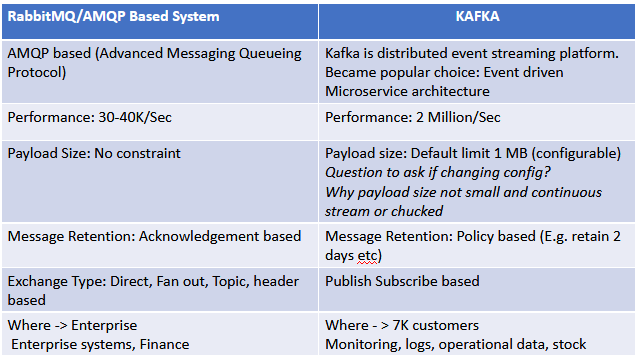

### Use Cases

- **Activity tracking**: The original use case  for Kafka, designed at Linkedin, is that of user activity tracking.

- **Messaing**: where applications need to send notifications to users. Those can produce messages without needing to be concerned about formatting. Then an other application can read all the messages and handle them consistently.

- **Metrics and logging**
- **Commit log**: Dataase changes can be published to Kafka and applications can easily monitor this stream to receive live updates ad they happen.
- **Stream processing**: Kafka  is extremely good for streaming and processing huge datasets.

## Kafka architecture

Kafka is a message broker. A broker is an intermediary that brings together twwo parties that don''t necessarily know each other for a mutually beneficial exchange or deal.

### Log
Is a file that Kafka appends incoming records to. A log is an append-only, totally ordered sequence of records ordered by time.

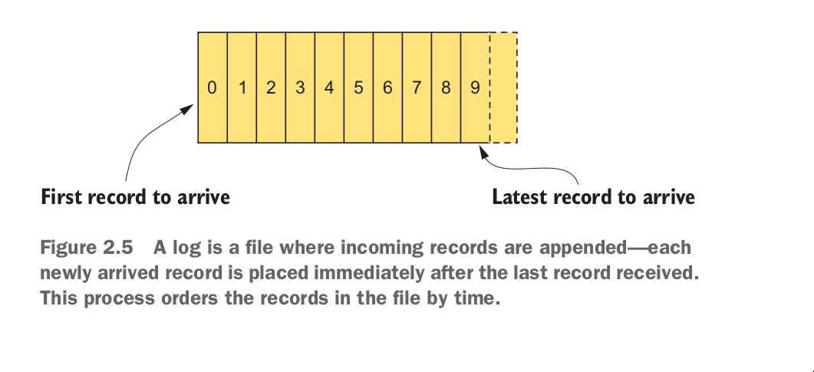

Configuration setting `log.dir`, specifies where `Kafka` stores log data on disk.

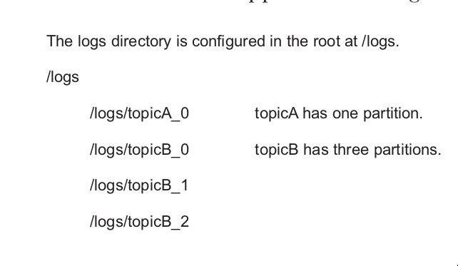

### Topics

Topics are logs that are seperated by topic name. Thinks topics as labeled logs. The closest analogies for a topic are a database table or a folder in a filesystem.

Topic name examples:
- orders
- customers
- payments

To help manage the load of messages coming into a topic. Kafka use `partitions`.

Topics are broken down into a number of `partitions`.

`Partitions` are the way that Kafka provides redundancy and scalability. Each partition can be hosted on a different server, which means that a single topic can be scaled horizontally across multiple servers.


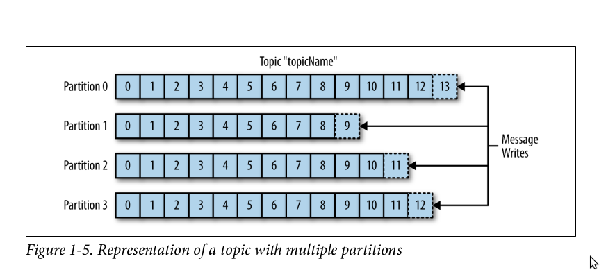

### Partitions
- Help incresing throughput.
- Allows topic messages to be spread across several machines so that the capacity of a given topic isn't limited to the availble disk space one one server.

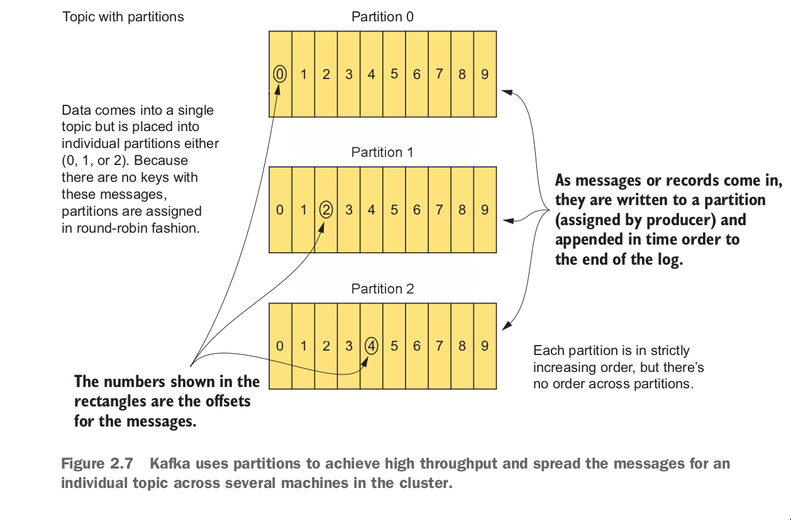

### Difference between Partition and Log?
At this time, you can come up with a question. Wait a minute, Aren't Log and Partition the same thing?
At first glance, they seems to look the same, but here are the difference: 
- Log: physical part of a topic, where a topic is stored on the disk.
- Partition: logical unit used to break down a topic into splits for redundancy and scalability.
You can see `Log` stored on disk. But with `Partition`, you can't. `Partition` is handled logically.


####  Partitions group data by key
When a message is sent to kafka, you can specify a `key` option for that message. 

If the key (key will be explained in the next section) isn't null. Kafka uses the following formula to calculate which partition the message will be sent to.

```
Producer -> message(key, value) -> Kafka
// Kafka choose a partition by using the formula
target_partition = HashCode.(key) % number of partitions
```
Records with the same key will always be sent to the same partition and in order.

### Important characteristics of Kafka
- Kafka stores and retrives message from topic. Doesn't keep any state of producers or consumers.
- Messages are written into Kafka in batches. A batch is just a collection of messages, all of which are being produced to the same topic and partition.

## Producers and Consumers

### Producer
`Producers` create new messages. In other publish/subcribe systems, these may be called publishers or writers. A message will be produced to a specific topic.
  - The producer does not care what partition a specifict message is written to and will balance messages over all partitions of a topic evenyly.
 - In some case, the producer will direct messages to specific partitions using `message key`. Messages with a specified `message key` will be ensured to come in the right order in a partition.
 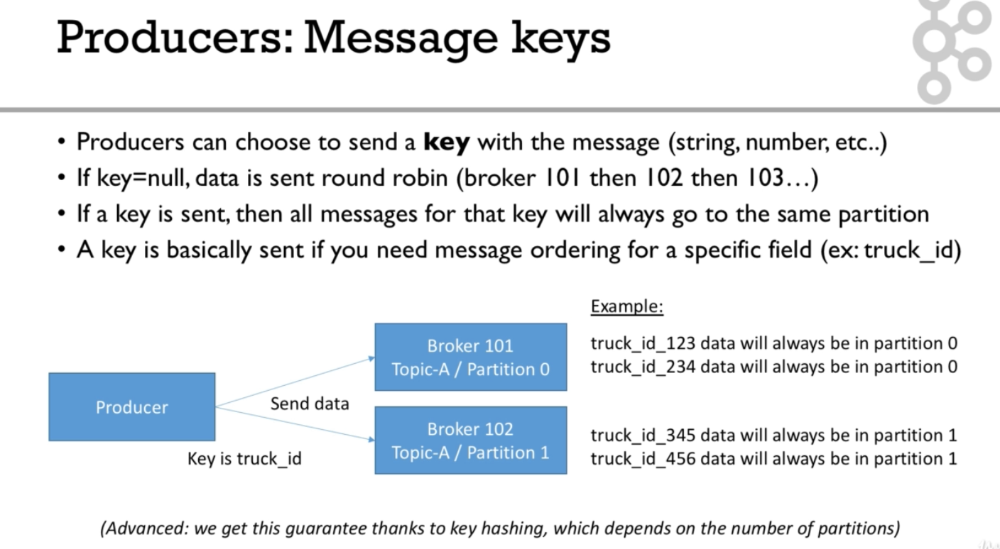

### Consumer

`Consumers` read messages. In other publish/subscribe systems, these may be called subscribers or readers.
- The consumer subscribes to one or more topics and reads the messages in the order in which they were produced.
- The consumer keeps track of which message it has already consumed by keeping track of the offset of messages.

The `offset` is a simple integer number that is used by Kafka to maintain the current position of a consumer.
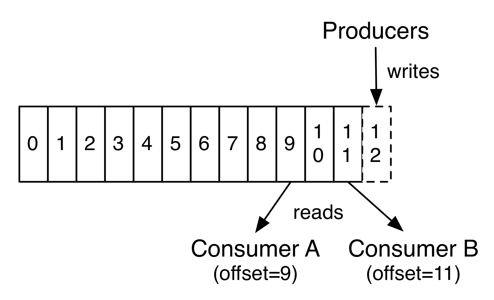

`Consumers` work as part of a `consumer group`, which is one or more consumers that work together to consume a topic. Group assures that each each partition is only consumed by one member. If a single consumer fails, the remaning members of group will rebalance the partitions being consumed to take over the missing member.

#### Consumer group

Consumers groups used to read and process data in parallel.

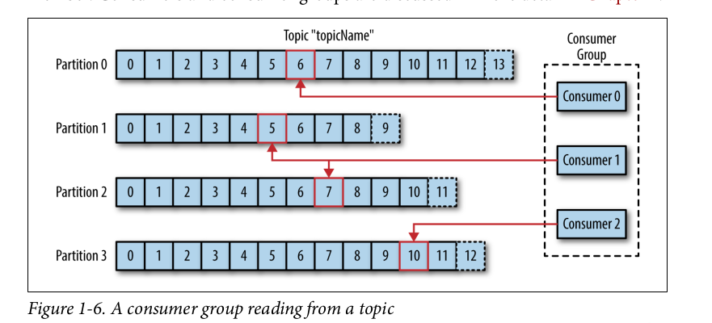

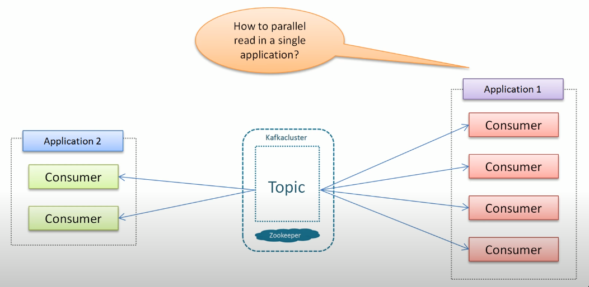

How consumers can read data in parallel without duplicate reads? Kafka provide a simple solution for this problem.
 - A partition can only be consumed by one consumer at a time. 
 - But a consumer can consumer multiple partitions parallelly.

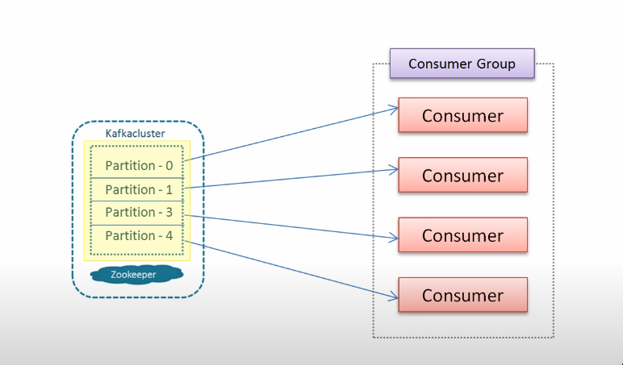

For example:
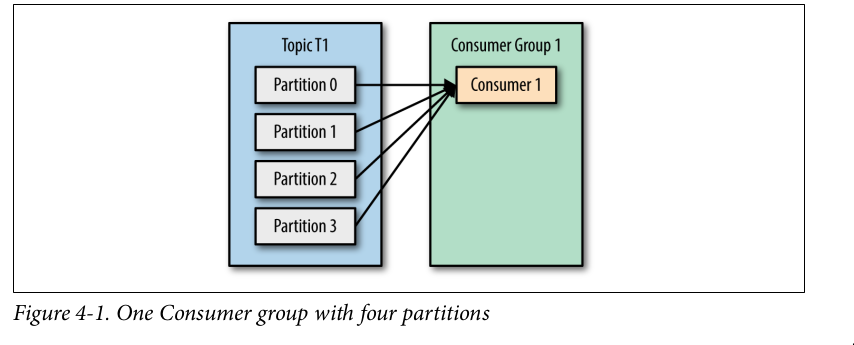
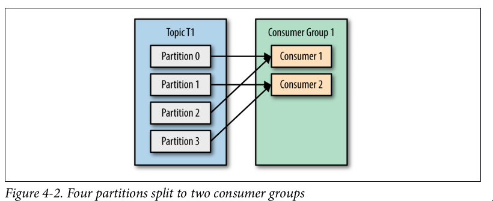
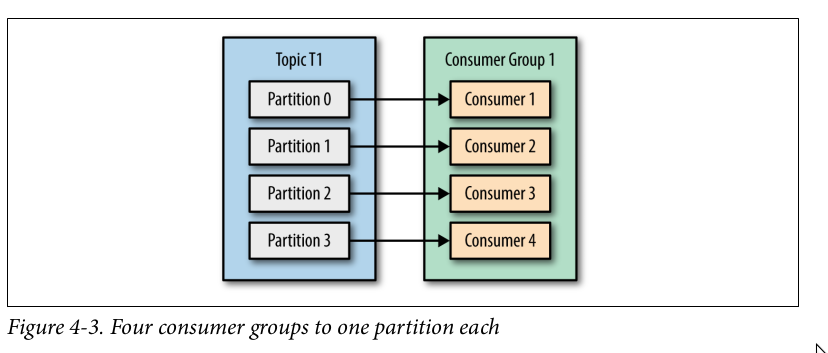
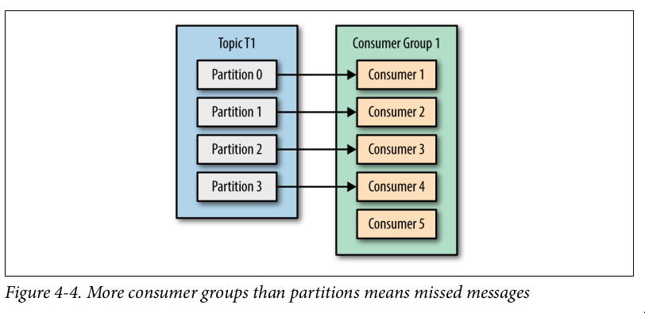

If the number of consumers in a group exceeds the number of partitions in a topic. Then there will be some idle consumer and get no messages at all.

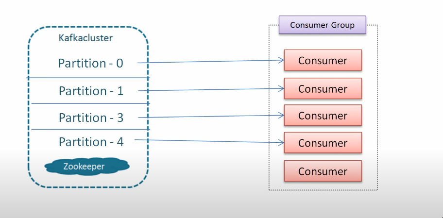

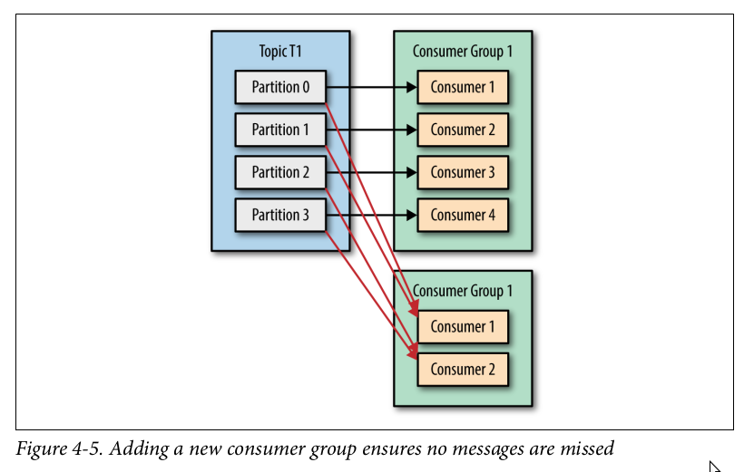

You can create a new consumer group for each application that needs all the messages from one or more topics.

#### Flow of sending a message
- Create a `ProducerRecord`, which must include the topic we want to send the record to and a value. Optionally, we can also specify a key and/or a partition.
- Then Serialized the key and value objects to `ByteArrays` so they can be sent over the network.
- Data is sent to a `partitioner`. The partition check if ProducerRecord has a specifed `partition` option. If yes, it doesn't do anything an reply the `partition` we specify. If not, the partitioner will choose a `partition` for us.
- Once a `partition` is selected, the producer then add the record to a `batch` of records that will also be sent to the same topic and partition.
- When broker receives the messages, it sends back a response. 
  - If the messages were successfully writtent to Kafka, return a RecordMetatData object contains `<topic, partition, offset>`
  - If failed, the broker will return an error. The producer may retry sending the message a few more times before giving up and returning an error.

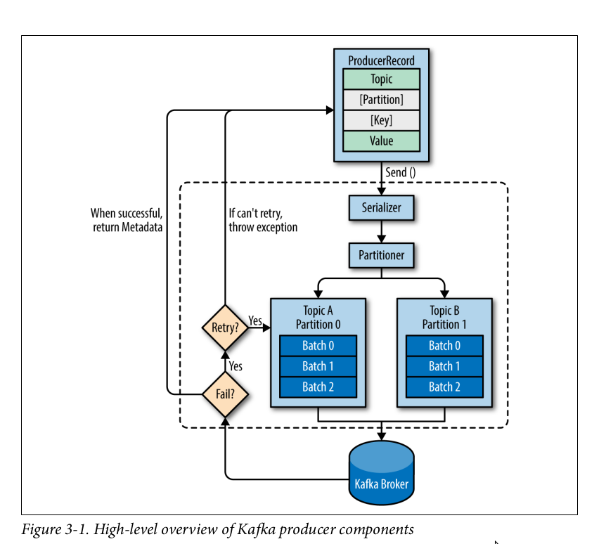

## Broker and Clusters

### Broker

A single Kafka server is called a broker. The broker receives messages from producers, assigns offsets to them and commits the messages to storage on disk.

Brokers are designed to operate as part of a cluster.

### Cluster membership management with Zookeeper

Kafka uses Apache Zookeeper to maintain the list of brokers that are currently members of a cluster. ZooKeeper is a consistent file system for configuration information.

It acts as a centralized service and helps to keep track of the Kafka cluster nodes status, Kafka topics, and partitions.

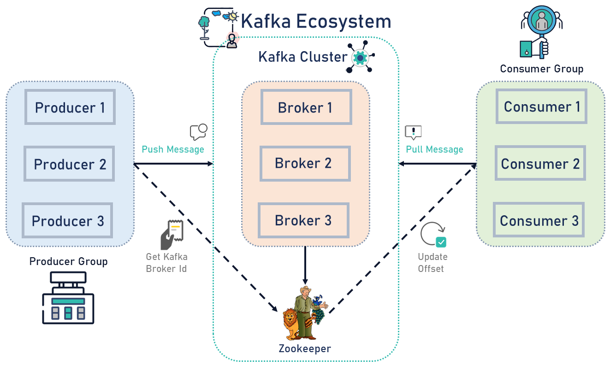

### Cluster controller
In a cluster, one broker will also function as the `cluster controller`

A cluster controller is one of the kafka brokers that in addition to the usual broker functionality:
- administrative operations: assigning partitions to brokers and monitoring for broker failures
- electing partition leaders(explained in the next section)
- Cluster only have one controller at a time
- The first broker that starts in the cluster becomes the controller.

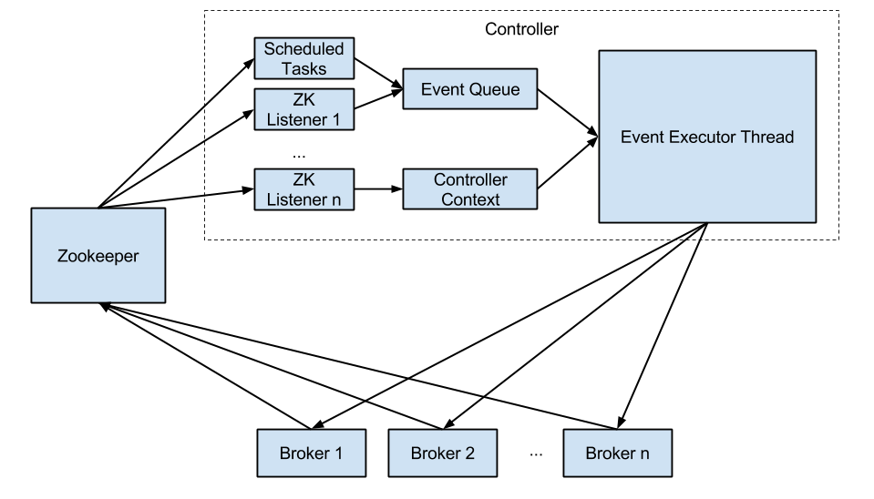


### Replica

Replication is at the heart of Kafka's architecture. It guarantees availability and
durability when individual nodes inevitably fail.
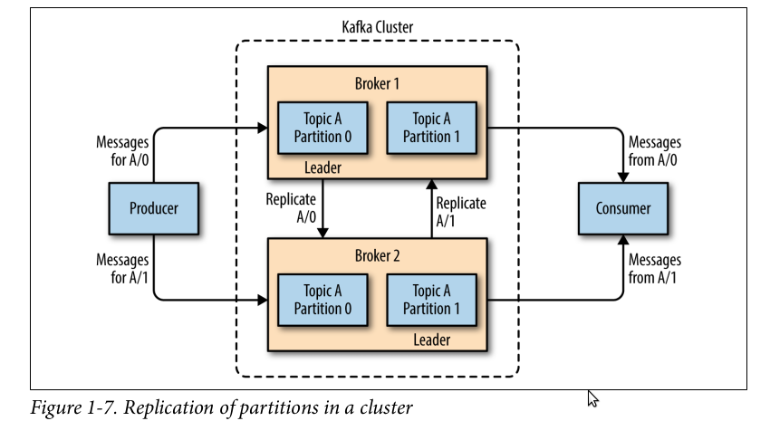

Each broker holds a number of partitions and each of these partitions can be either a leader or a replica for a topic

There are two types of replica:

#### Leader replica
- Each partition has a single replica designated as the leader.
- All produce and consume requests go through the leader, in order to guarantee consistency.
- Each partition also have a `prefered leader`, the replica that was the leader when the topic is originally created.

#### Follower replica
- All replicas for a partition that are not leaders are called followers
- Followers don't serve client requests.
- Only replicate messages from the leader and stay up-to-date with the most recent message the leader has.
- When a leader crashes, one of follower replica will be promoted to become the leader.
- A Follower replica that catch up with the most recent messages of the leader are callled In-Sync replica.
- Only in-sync replicas are eligible to be elected as partition leader in case the existing leader fail.